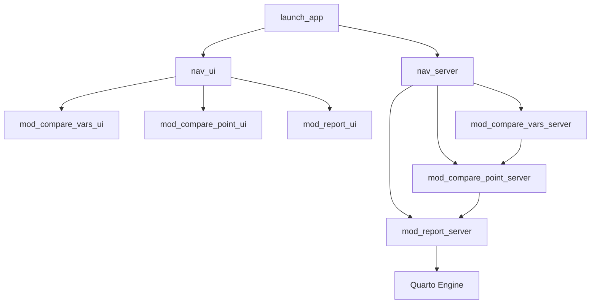
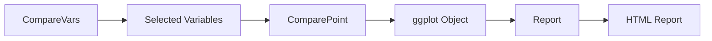
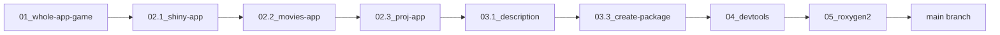

# sap (Shiny App-Packages)

> Educational R package demonstrating how to structure Shiny applications as packages with modular architecture and integrated external tools

## Overview

The `sap` package serves as the complete code repository for the "Shiny App-Packages" book and related workshops. It's built around a movie review analysis application that demonstrates best practices for organizing Shiny apps as R packages, with particular emphasis on modular design patterns and integration of external document generation tools.

This is **not a production movie analysis tool** - it's a comprehensive learning resource showing how to evolve a basic Shiny app into a fully-structured, testable, and maintainable R package.

## Learning Objectives

The codebase teaches two primary patterns:

**Shiny Package Structure:** How to organize a Shiny application using standard R package conventions (DESCRIPTION, NAMESPACE, proper exports/imports, testing, documentation)

**Modular Development:** Using Shiny modules to enhance application clarity through structured component organization, where each module can be written, analyzed, and tested independently

**External Tool Integration:** General pattern for incorporating document generation tools (like Quarto) within Shiny modules to create downloadable reports

## Quick Reference

- **Language:** R
- **Framework:** Shiny with bslib theming
- **Architecture:** Modular Shiny app structured as R package
- **Data:** IMDB movie reviews (651 movies, 34 variables)
- **Dependencies:** tidyverse, ggplot2 + extensions, plotly, quarto
- **Testing:** testthat with comprehensive module testing
- **Documentation:** Quarto vignettes, roxygen2

## Architecture

The application follows a **modular Shiny design** where functionality is broken into independent, testable modules that communicate through well-defined interfaces.



### Core Module Pattern

The three `mod_compare_*` modules demonstrate the key architectural principles:

**Variable Selection Module (`mod_compare_vars`):** Handles user input for selecting plot variables and aesthetic mappings

**Point Plot Module (`mod_compare_point`):** Creates interactive scatter plots using the selected variables

**Module Communication:** Data flows from variable selection to plotting through reactive values, demonstrating how modules interact within the overall app server



### Report Integration Pattern

The `mod_report` module showcases the general pattern for integrating external document generation:

1. **Module Interface:** Standard Shiny module UI/server pattern
2. **External Tool Integration:** Quarto rendering within the module server function  
3. **File Management:** Temporary file handling and download mechanism
4. **User Feedback:** Progress indicators and error handling

## Data Structure

The application analyzes the `movies` dataset with 651 observations:

| Variable Type | Examples | Purpose |
|---------------|----------|---------|
| **Ratings** | `imdb_rating`, `critics_score`, `audience_score` | Continuous variables for comparison plots |
| **Categories** | `mpaa_rating`, `genre`, `critics_rating` | Grouping variables for aesthetic mappings |
| **Awards** | `best_pic_win`, `best_actor_win`, `top200_box` | Binary outcomes for specialized analysis |
| **Metadata** | `title`, `director`, `runtime`, `studio` | Descriptive information and additional plotting options |

## Technical Implementation

### Key Dependencies

**Core Shiny Stack:**
- `shiny`: Base framework
- `bslib`: Modern Bootstrap theming
- `bsicons`: Icon system

**Data & Visualization:**
- `ggplot2` + `ggdist`, `ggwaffle`, `ggrepel`: Visualization layers
- `plotly`: Interactive plots
- `dplyr`, `tidyr`, `forcats`: Data manipulation

**External Integration:**
- `quarto`: Document generation
- `gt`: Table formatting in reports

### Directory Structure

```
sap/
├── DESCRIPTION              # Package metadata and dependencies
├── NAMESPACE               # Exported functions and imports
├── R/                      # All R code
│   ├── launch_app.R        # Main application entry point
│   ├── nav_ui.R           # Top-level UI with navigation
│   ├── nav_server.R       # Top-level server logic
│   ├── mod_compare_*.R    # Core comparison modules (3 files)
│   ├── mod_awards_*.R     # Award analysis modules
│   ├── mod_counts_*.R     # Count/frequency modules  
│   ├── mod_dist_*.R       # Distribution analysis modules
│   ├── mod_report.R       # Report generation module
│   └── data.R             # Dataset documentation
├── data/                   # Package datasets (.rda files)
├── inst/                   # Package installation files
│   ├── extdata/           # Raw data files
│   ├── rmd/               # Report templates
│   └── www/               # Web assets
├── man/                    # Generated documentation
├── tests/testthat/        # Module tests
├── vignettes/             # Quarto documentation
└── app.R                  # Standalone app launcher
```

### Module Organization

**Functional Groupings:**
- `mod_compare_*`: Variable selection and scatter plotting (3 modules)
- `mod_awards_*`: Award winner analysis (3 modules) 
- `mod_counts_*`: Frequency analysis with multiple visualizations (5 modules)
- `mod_dist_*`: Distribution analysis (4 modules)
- `mod_report`: External document generation (1 module)

Each functional group follows the pattern: `vars` (input) → `point/bar/box` (visualization) → `tbl` (tabular display)

## Development Workflow

### Sequential Learning Path

The repository uses **git branches** to show progressive development stages:



### Getting Started

**Install and explore:**
```r
# Install the shinypak helper
pak::pak("mjfrigaard/shinypak")
library(shinypak)

# List all developmental stages
list_apps()

# Launch a specific stage
launch(app = "02.3_proj-app")

# Or work with the main package
devtools::install_github("mjfrigaard/sap")
library(sap)
launch_app()
```

**Local development:**
```bash
git clone https://github.com/mjfrigaard/sap.git
cd sap
git checkout <branch_name>  # Explore different stages
open sap.Rproj
```

### Testing

The package includes comprehensive module testing:

```r
# Run all tests
devtools::test()

# Test specific modules (focus on core patterns)
testthat::test_file("tests/testthat/test-mod_compare_vars_server.R")
testthat::test_file("tests/testthat/test-mod_compare_point_server.R")
```

### Documentation

**Generate documentation:**
```r
devtools::document()  # Update roxygen2 docs
devtools::build_vignettes()  # Build Quarto vignettes
```

## Code Conventions

**R Package Standards:**
- Use `<-` for assignment throughout
- Native base-R pipe `|>` for piped expressions  
- Tidyverse-style function naming (`snake_case`)
- Comprehensive roxygen2 documentation for all exported functions

**Shiny Module Patterns:**
- Module functions named `mod_[feature]_ui()` and `mod_[feature]_server()`
- Consistent `id` parameter handling
- Reactive values passed between modules, not direct variable access
- Each module tested independently with mock data

## Important Notes

**Learning Focus:** Start with the three `mod_compare_*` modules - these demonstrate the clearest examples of variable selection → visualization → reporting workflow

**Branch Strategy:** Each branch represents a chapter/concept - use `shinypak::list_apps()` to see the complete progression rather than jumping directly to main

**Module Independence:** Each module is designed to be understood and tested in isolation, making it easier to grasp individual patterns before seeing the full integration

**External Integration:** The report generation pattern in `mod_report` is intentionally general - it can be adapted for other external tools beyond Quarto

## Resources

- **Book:** [Shiny App-Packages](https://mjfrigaard.github.io/shiny-app-pkgs/)
- **Workshop:** [Developing & Testing Your Shiny Application](https://mjfrigaard.github.io/dev-test-shiny/)
- **Helper Package:** [shinypak](https://mjfrigaard.github.io/shinypak/)
- **All Branches:** [Repository branches](https://github.com/mjfrigaard/sap/branches/all)
- **Original Data Source:** [Building Web Applications with Shiny course](https://rstudio-education.github.io/shiny-course/)
